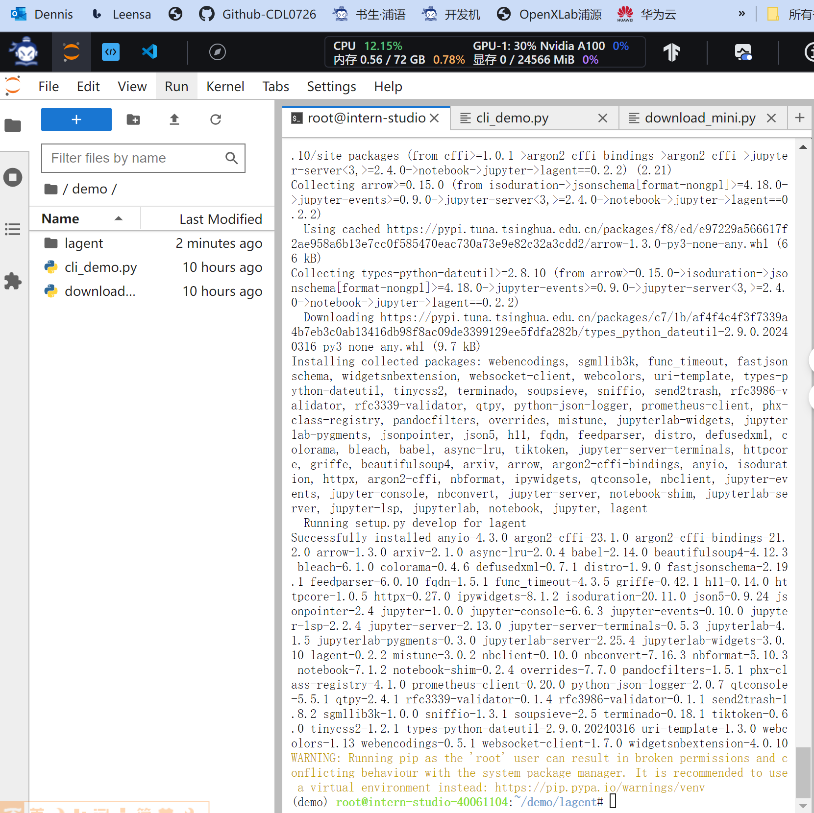
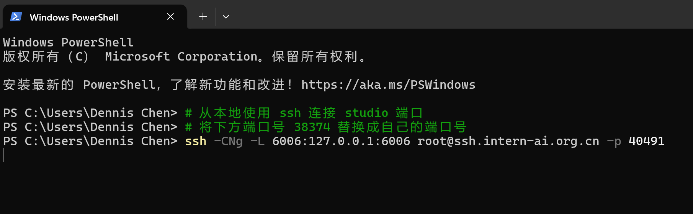
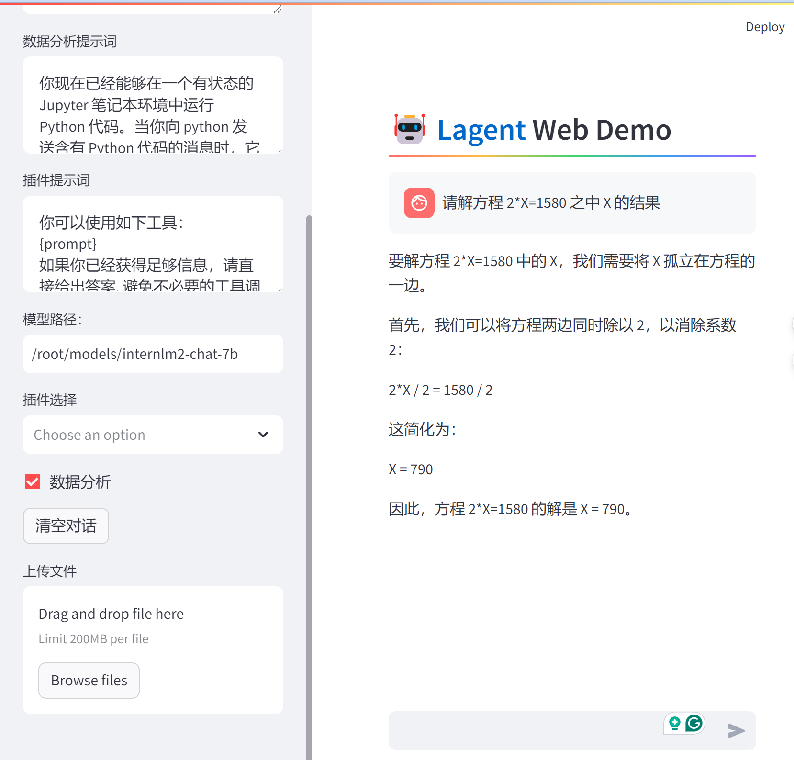

# Healthcare-Agent 医疗保健智能体

### 1. 项目介绍 
GenAI赋能，解读用户的健康密码，根据个性化的数据，生成易懂化的解读，为家庭健康决策人提供全寿命周期的健康管理大语言模型智能体，成为陪伴用户一生的健康伴侣。
   
### 2. HealthcareAgent 医疗保健智能体 2B 主要功能：  
  - 智能问答
  - CVD(心血管）慢病管理
  - 数据分析（报告解读及对比分析）


### 3. 模型工具
[InternLM2](https://github.com/InternLM/InternLM)    [Lagent](https://github.com/InternLM/lagent)  
[开源代码](https://open-compass.github.io/T-Eval/)  
[项目主页](open-compass.github.io/T-Eval)  
[论文](arxiv.org/abs/2312.14033)  

      
### 4. Healthcare Agent 医疗保健智能体 构建
使用 `Lagent` 运行 `InternLM2-Chat-7B` 模型为内核的智能体

#### 4.1 Lagent 相关知识
Lagent 是一个轻量级、开源的基于大语言模型的智能体（agent）框架，支持用户快速地将一个大语言模型转变为多种类型的智能体，并提供了一些典型工具为大语言模型赋能。它的整个框架图如下:   
   

Lagent 的特性总结如下：
- 流式输出：提供 stream_chat 接口作流式输出，本地就能演示酷炫的流式 Demo。
- 接口统一，设计全面升级，提升拓展性，包括：  
    - Model : 不论是 OpenAI API, Transformers 还是推理加速框架 LMDeploy 一网打尽，模型切换可以游刃有余；         
    - Action: 简单的继承和装饰，即可打造自己个人的工具集，不论 InternLM 还是 GPT 均可适配；        
    - Agent：与 Model 的输入接口保持一致，模型到智能体的蜕变只需一步，便捷各种 agent 的探索实现；  
- 文档全面升级，API 文档全覆盖。

#### 4.2 环境配置
开启 30% A100 权限
  重新开启开发机，输入命令，开启 conda 环境：

```bash
conda activate demo
```

打开文件子路径

```bash
cd /root/demo
```

使用 git 命令下载 Lagent 相关的代码库：  

```bash
git clone https://gitee.com/internlm/lagent.git
# git clone https://github.com/internlm/lagent.git
cd /root/demo/lagent
git checkout 581d9fb8987a5d9b72bb9ebd37a95efd47d479ac
pip install -e . # 源码安装
```
运行效果如图：  
   
        
#### 4.3 使用 Lagent 运行 InternLM2-Chat-7B 模型为内核的智能体   
打开 lagent 路径：

```bash
cd /root/demo/lagent
```

在 terminal 中输入指令，构造软链接快捷访问方式：

```bash
ln -s /root/share/new_models/Shanghai_AI_Laboratory/internlm2-chat-7b /root/models/internlm2-chat-7b
```

打开 `lagent` 路径下 `examples/internlm2_agent_web_demo_hf.py` 文件，并修改对应位置 (71行左右) 代码：  
```bash
# 其他代码...
value='/root/models/internlm2-chat-7b'
# 其他代码...
```

输入运行命令 - **点开 6006 链接后，大约需要 5 分钟完成模型加载：**

```bash
streamlit run /root/demo/lagent/examples/internlm2_agent_web_demo_hf.py --server.address 127.0.0.1 --server.port 6006
```

待程序运行的同时，对本地端口环境配置本地 `PowerShell` 。  
最终保持在如下效果即可：  
    


```
请解方程 2*X=1580 之中 X 的结果
```

  

