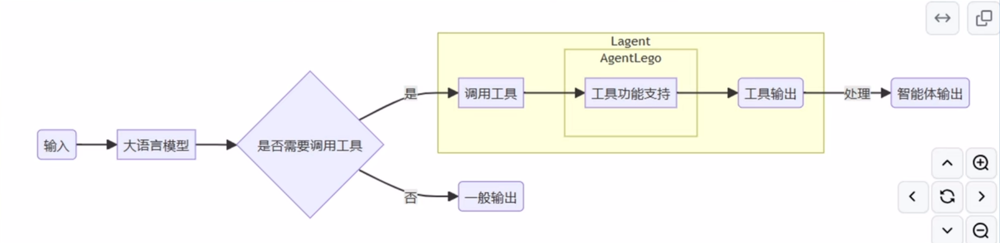
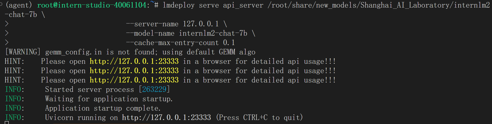
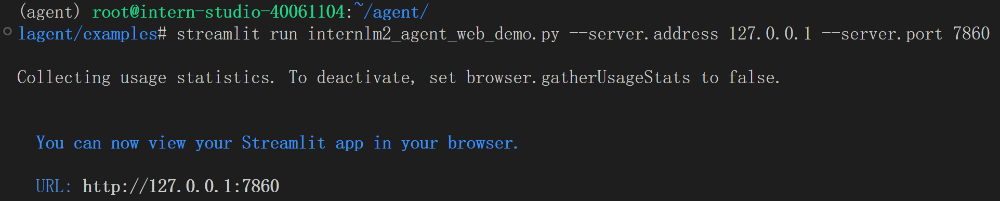
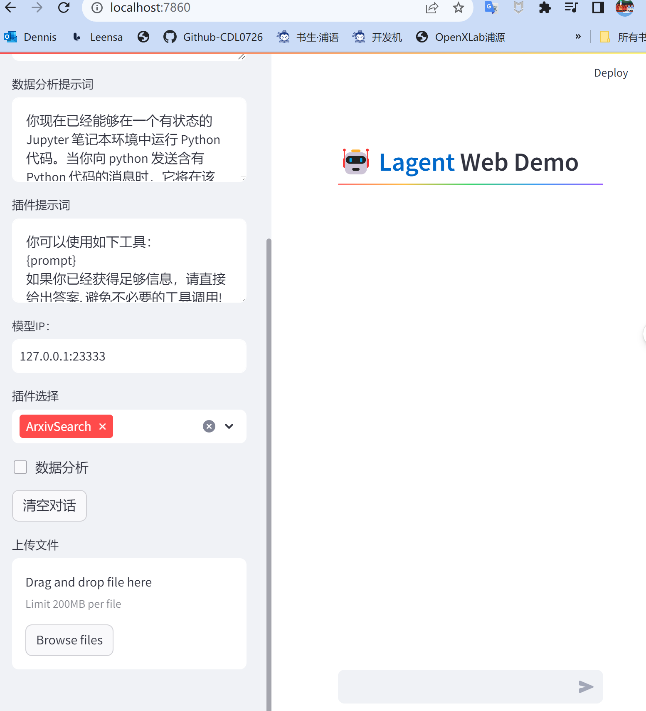
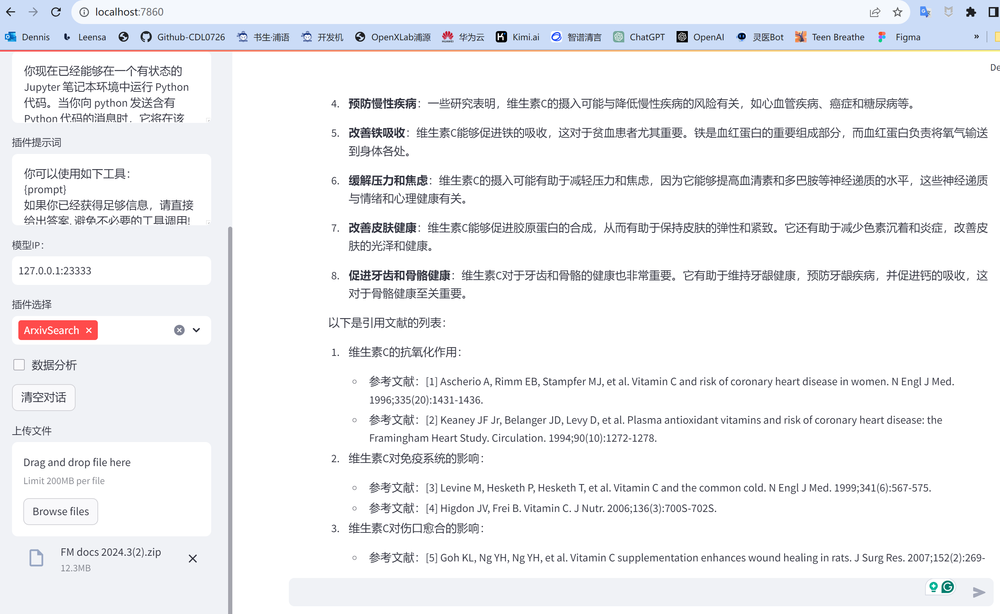
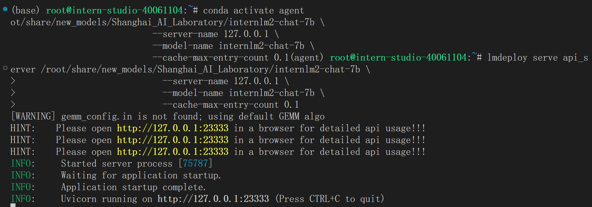
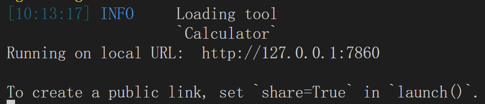
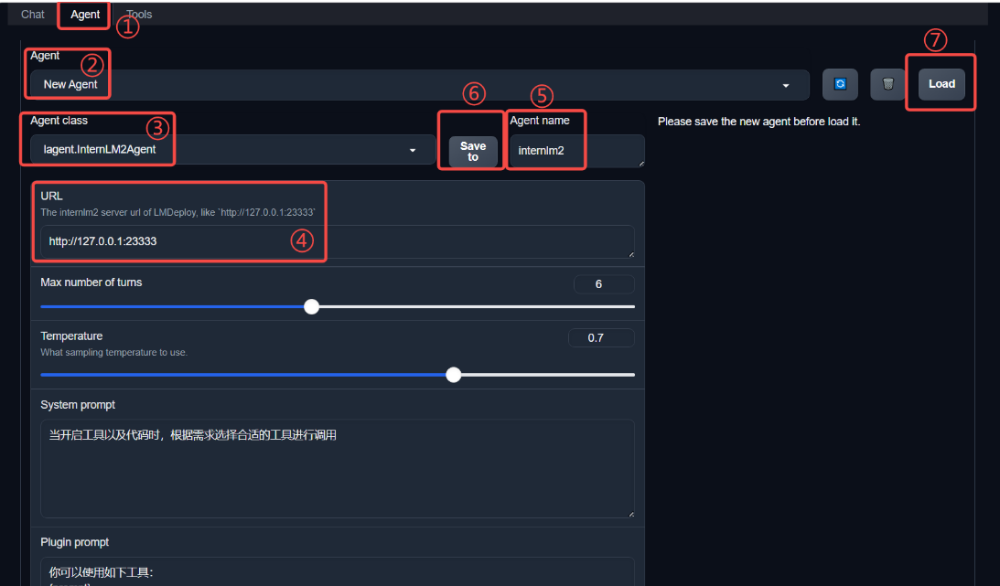
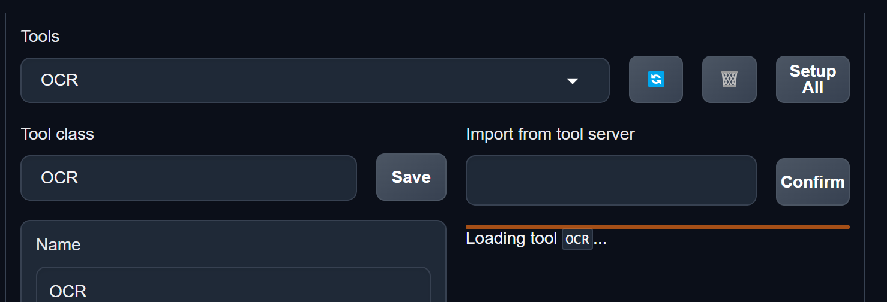
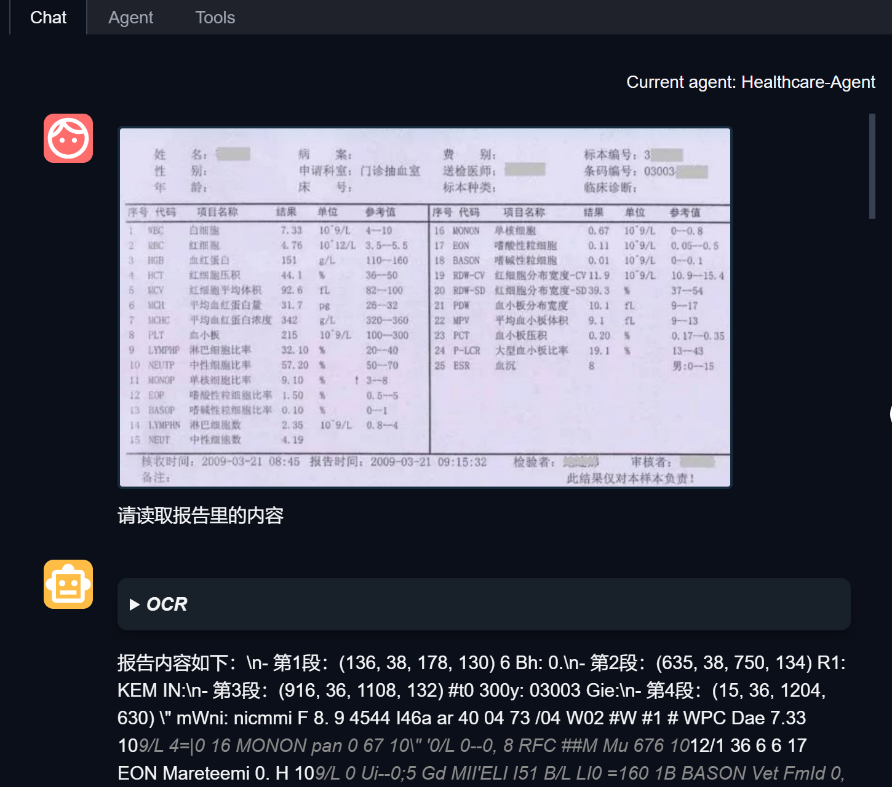

# Healthcare-Agent 医疗保健智能体

    

## 1. 项目介绍 
GenAI赋能，解读用户的健康密码，根据个性化的数据，生成易懂化的解读，为家庭健康决策人提供全寿命周期的健康管理大语言模型智能体，成为陪伴用户一生的健康伴侣。

[OpenXLab体验](https://openxlab.org.cn/apps/detail/NagatoYuki0943/HealthcareAgent) 
   
## 2. HealthcareAgent 医疗保健智能体 主要功能：  
  - 智能问答
  - CVD(心血管）慢病管理
  - 数据分析（报告解读及对比分析）


## 3. 智能体调用的模型与工具
[InternLM2](https://github.com/InternLM/InternLM)    
[Lagent](https://github.com/InternLM/Lagent)    [AgentLego](https://github.com/InternLM/AgentLego) 

[开源代码](https://open-compass.github.io/T-Eval/)     [项目主页](open-compass.github.io/T-Eval)    
  
[源码地址-洪图-2024.4](https://github.com/NagatoYuki0943/HealthcareAgent/blob/main/LLM.py)    [Agent](https://github.com/CDL0726/InternLM2-Tutorial-Assignment-Lecture6-Lagent/edit/main/README.md)    

论文： 
[Agent-FLAN 技术报告](https://arxiv.org/abs/2403.12881)      [Repo](https://github.com/InternLM/Agent-FLAN)  

      
## 4. 智能体介绍    

### 4.1 什么是智能体    

智能体概念的第一次提出： Hayes-Roth 1995, An Architecture for Adaptive Intelligent Systems.    
一个智能体需要满足以下3个条件：     

1. Perception of dynamic conditions in the environment
   可以感知环境中的动态条件。

2. Action to affect conditions in the environment
   能采取动作影响环境。

3. Reasoning to interpret perceptions, solve problems, draw inferences, and determine actions.   
   能运用推理能力理解信息、解决问题，产生推断、决定动作。

智能体组成：

  1. 大脑：作为控制器，承担记忆、思考和决策任务。接收来自感知和模块的信息，并采取相应动作。
     
  2. 感知：对外部环境的多模态信息进行感知和处理。包括但不限于图像、音频、视频、传感器等。
     
  3. 动作： 利用并执行工具以影响环境。工具可能包括文本的检索、调用相关API、操控机械臂等。

  

### 4.2 Lagent与AgentLego相关知识     

Lagent 是一个轻量级开源智能体框架，旨在让用户可以高效地构建基于大语言模型的智能体。同时它也提供了一些典型工具以增强大语言模型的能力。

AgentLego 是一个提供了多种开源工具 API 的多模态工具包，旨在像是乐高积木一样，让用户可以快速简便地拓展自定义工具，从而组装出自己的智能体。通过 AgentLego 算法库，不仅可以直接使用多种工具，也可以利用这些工具，在相关智能体框架（如 Lagent，Transformers Agent 等）的帮助下，快速构建可以增强大语言模型能力的智能体

 Lagent 是一个智能体框架，而 AgentLego 与大模型智能体并不直接相关，而是作为工具包，在相关智能体的功能支持模块发挥作用。   

 两者之间的关系可以用下图来表示：    




## 5. Healthcare-Agent 医疗保健智能体 应用搭建

### 5.1 环境配置      

5.1.1 创建开发机和 conda 环境    

创建开发机Agent: 选择镜像为` Cuda12.2-conda`，并选择 GPU 为`30% A100`。

进入开发机后，为了方便使用，我们需要配置一个环境以同时满足 Lagent 和 AgentLego 运行时所需依赖。在开始配置环境前，我们先创建一个用于存放 Agent 相关文件的目录，可以执行如下命令：  
```
mkdir -p /root/agent
```

开始配置 conda 环境，可以输入如下指令： 
```
studio-conda -t agent -o pytorch-2.1.2
```     

5.1.2 安装 Lagent 和 AgentLego    

Lagent 和 AgentLego 都提供了两种安装方法，一种是通过 pip 直接进行安装，另一种则是从源码进行安装。为了方便使用 Lagent 的 Web Demo 以及 AgentLego 的 WebUI，我们选择直接从源码进行安装。 此处附上源码安装的相关帮助文档：   

- Lagent：https://lagent.readthedocs.io/zh-cn/latest/get_started/install.html
- AgentLego：https://agentlego.readthedocs.io/zh-cn/latest/get_started.html

执行如下命令进行安装：    

```
cd /root/agent
conda activate agent
git clone https://gitee.com/internlm/lagent.git
cd lagent && git checkout 581d9fb && pip install -e . && cd ..
git clone https://gitee.com/internlm/agentlego.git
cd agentlego && git checkout 7769e0d && pip install -e . && cd ..
```

5.1.3 安装其他依赖   

在这一步中，我们将会安装其他将要用到的依赖库，如 LMDeploy，可以执行如下命令：   

 ```
conda activate agent
pip install lmdeploy==0.3.0
```

5.1.4 准备 Tutorial

由于后续的 Demo 需要用到 tutorial 已经写好的脚本，因此我们需要将 tutorial 通过 git clone 的方法准备好，以备后续使用：   

```
cd /root/agent
git clone -b camp2 https://gitee.com/internlm/Tutorial.git
```

###  5.2 Lagent：轻量级智能体框架
 
在这一部分中，将体验 Lagent 的 Web Demo，使用 Lagent 自定义工具，并体验自定义工具的效果。    

详细文档可以访问：[Lagent：轻量级智能体框架](https://github.com/InternLM/Tutorial/blob/camp2/agent/lagent.md)    

5.2.1 Lagent Web Demo    

5.2.1.1 使用 LMDeploy 部署    

由于 Lagent 的 Web Demo 需要用到 LMDeploy 所启动的 api_server，因此我们首先按照下图指示在 vscode terminal 中执行如下代码使用 LMDeploy 启动一个 api_server。    

```
conda activate agent
lmdeploy serve api_server /root/share/new_models/Shanghai_AI_Laboratory/internlm2-chat-7b \
                            --server-name 127.0.0.1 \
                            --model-name internlm2-chat-7b \
                            --cache-max-entry-count 0.1
```

5.2.1.2 启动并使用 Lagent Web Demo    

接下来我们按照下图指示新建一个 terminal 以启动 Lagent Web Demo。在新建的 terminal 中执行如下指令：    

```
conda activate agent
cd /root/agent/lagent/examples
streamlit run internlm2_agent_web_demo.py --server.address 127.0.0.1 --server.port 7860
```

在等待 LMDeploy 的 api_server 与 Lagent Web Demo 完全启动后（如下图所示），在本地进行端口映射，将 LMDeploy api_server 的23333端口以及 Lagent Web Demo 的7860端口映射到本地。可以执行：

```
ssh -CNg -L 7860:127.0.0.1:7860 -L 23333:127.0.0.1:23333 root@ssh.intern-ai.org.cn -p 49688
```

|LMDeploy|Lagent Web Demo|
|---|---|
|||   

接下来在本地的浏览器页面中打开 `http://localhost:7860` 以使用 Lagent Web Demo。首先输入模型 IP 为 `127.0.0.1:23333`，在输入完成后按下回车键以确认。

可以在Web端与模型进行对话。     

选择插件为 `ArxivSearch`，以让模型获得在 arxiv 上搜索论文的能力。    



可以左下角的文件上传处，直接上传PDF压缩文件，然后让智能根据上传的文件来回答问题，并列出回答所引用的资料，效果如下：

  


### 5.3 AgentLego：医疗保健智能体“乐高”组装      

在这一部分中，我们将直接使用 AgentLego 工具，体验 AgentLego 的 WebUI，以及基于 AgentLego 自定义工具并体验自定义工具的效果。     

详细文档可以访问：[AgentLego：组装智能体“乐高”](https://github.com/InternLM/Tutorial/blob/camp2/agent/agentlego.md)      


5.3.2 AgentLego作为智能体工具使用    

5.3.2.1 使用 LMDeploy 部署    

由于 AgentLego 的 WebUI 需要用到 LMDeploy 所启动的 api_server，因此我们首先按照下图指示在 vscode terminal 中执行如下代码使用 LMDeploy 启动一个 api_server。    

```
conda activate agent
lmdeploy serve api_server /root/share/new_models/Shanghai_AI_Laboratory/internlm2-chat-7b \
                            --server-name 127.0.0.1 \
                            --model-name internlm2-chat-7b \
                            --cache-max-entry-count 0.1
```

5.3.2.2 启动 AgentLego WebUI    

接下来我们按照下图指示新建一个 terminal 以启动 AgentLego WebUI。在新建的 terminal 中执行如下指令：    

```
conda activate agent
cd /root/agent/agentlego/webui
python one_click.py
```

在等待 LMDeploy 的 api_server 与 AgentLego WebUI 完全启动后（如下图所示），在本地进行端口映射，将 LMDeploy api_server 的23333端口以及 AgentLego WebUI 的7860端口映射到本地。可以执行：   

```
ssh -CNg -L 7860:127.0.0.1:7860 -L 23333:127.0.0.1:23333 root@ssh.intern-ai.org.cn -p 49688
```

|LMDeploy api_server|AgentLego WebUI|
|---|---|   
| | |      


5.3.2.3 使用 AgentLego WebUI      

接下来在本地的浏览器页面中打开 http://localhost:7860 以使用 AgentLego WebUI。首先来配置 Agent，如下图所示。    

  1.点击上方 Agent 进入 Agent 配置页面。（如①所示）
  2.点击 Agent 下方框，选择 New Agent。（如②所示）    
  3.选择 Agent Class 为 lagent.InternLM2Agent。（如③所示）    
  4.输入模型 URL 为 http://127.0.0.1:23333 。（如④所示）    
  5.输入 Agent name，自定义即可，图中输入了 internlm2。（如⑤所示）    
  6.点击 save to 以保存配置，这样在下次使用时只需在第2步时选择 Agent 为 internlm2 后点击 load 以加载就可以了。（如⑥所示）    
  7.点击 load 以加载配置。（如⑦所示）    

   


然后配置工具OCR，
在Vscode 里打开新的Terminal, 运行下列命令安装OCR：    

```
conda activate agent
pip install easyocr
```

如下图所示。    

  1. 点击上方 Tools 页面进入工具配置页面。（如①所示）
  2. 点击 Tools 下方框，选择 New Tool 以加载新工具。（如②所示）
  3. 选择 Tool Class 为 OCR。（如③所示）
  4. 点击 save 以保存配置，这一步会需要较长时间，耐心等待。（如④所示）

    

等待工具加载完成后，点击上方 Chat 以进入对话页面,效果如下图：   

  

## 6. 模型微调 XTuner

### 6.1 开发机准备    

使用 `Cuda11.7-conda` 镜像，然后在资源配置中，使用 `10% A100 * 1` 的选项，创建开发机器。

### 6.2 XTuner 模型微调

6.2.1 环境安装   

- 安装一个 XTuner：`studio-conda xtuner0.1.17`
- 激活环境: `conda activate xtuner0.1.17`
- 进入家目录: `cd ~`
- 创建版本文件夹并进入: `mkdir -p /root/xtuner0117 && cd /root/xtuner0117`
- 拉取 0.1.17 的版本源码:  `git clone -b v0.1.17  https://github.com/InternLM/xtuner`
- 进入源码目录: ` cd /root/xtuner0117/xtuner`
- 从源码安装 XTuner: `pip install -e '.[all]'`

6.2.2 前期准备

6.2.2.1 数据集准备


### 6.3 模型转换、整合、测试及部署   


## 7. 进一步完善点：

- 医疗数据整理；
- 技术路线图绘制；
- OCR的识别精准提升，特别是文字部分；
- 自定义链接工具，如医疗机构推荐      

     
