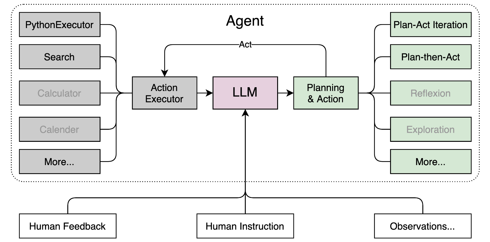

# Healthcare-Agent

     

## 1. 项目介绍 
Healthcare-Agent是一个医疗保健智能体，基于GenAI赋能，解读用户的健康密码，根据个性化的数据，生成易懂化的解读，为医疗保健工作者赋能提效，为家庭健康决策人提供全生命周期的健康管理。它将成为您一生的健康伴侣，随时随地守护您的健康。

---
## 2. 主要功能：  
  - **医疗智能问答 AI Health Bot：** 基于医疗知识的智能问答，有专业溯源依据。
  - **报告分析 Healthcare Textract：** 上传检查报告，AI自动分析，提供白话解读，原因分析和相关建议。
  - **CVD慢病管理 MMPose：** 基于人体建模和姿态识别技术，GenAI加持，助力脑卒中患者的提前发现 预防和治疗。

对于智能体的具体介绍，参考B站的 [**宣传视频**]

**免责声明**        
  
本文件中的信息仅供学术交流使用。其目的是用于教育和研究，不得用于任何商业或法律目的。作者不保证信息的准确性、完整性或可靠性。本文件中使用的信息和数据，仅用于学术研究目的。这些数据来自公开可用的来源，作者不对数据的所有权或版权提出任何主张。    

Healthcare-Agent是一个医疗保健智能体，可以赋能提效医疗保健从业者，也可以家庭用户提供便捷医疗咨询服务。内容输出是利用大模型的推理能力，不能代替医生，不承担法律责任。

---
## 3. 架构    

     

|模型|项目Demo|智能体工具|开源代码|源码地址|论文|    
|---|---|---|---|---|---|
|[InternLM2](https://github.com/InternLM/InternLM)|[Demo](https://openxlab.org.cn/apps/detail/NagatoYuki0943/HealthcareAgent)|[Lagent](https://github.com/InternLM/Lagent) [AgentLego](https://github.com/InternLM/AgentLego) |[T-Eval](https://open-compass.github.io/T-Eval/)| [洪图-2024](https://github.com/NagatoYuki0943/HealthcareAgent/blob/main/LLM.py)|[Agent-FLAN](https://arxiv.org/abs/2403.12881)  [Repo](https://github.com/InternLM/Agent-FLAN) |
      
---
## 4. 智能体介绍    

### 4.1 什么是智能体    

智能体概念的第一次提出： Hayes-Roth 1995, An Architecture for Adaptive Intelligent Systems.    
一个智能体需要满足以下3个条件：     

1. Perception of dynamic conditions in the environment
   可以感知环境中的动态条件。

2. Action to affect conditions in the environment
   能采取动作影响环境。

3. Reasoning to interpret perceptions, solve problems, draw inferences, and determine actions.   
   能运用推理能力理解信息、解决问题，产生推断、决定动作。

智能体组成：

  1. 大脑：作为控制器，承担记忆、思考和决策任务。接收来自感知和模块的信息，并采取相应动作。
     
  2. 感知：对外部环境的多模态信息进行感知和处理。包括但不限于图像、音频、视频、传感器等。
     
  3. 动作： 利用并执行工具以影响环境。工具可能包括文本的检索、调用相关API、操控机械臂等。

  

### 4.2 Lagent与AgentLego相关知识     

Lagent 是一个轻量级开源智能体框架，旨在让用户可以高效地构建基于大语言模型的智能体。同时它也提供了一些典型工具以增强大语言模型的能力。

AgentLego 是一个提供了多种开源工具 API 的多模态工具包，旨在像是乐高积木一样，让用户可以快速简便地拓展自定义工具，从而组装出自己的智能体。通过 AgentLego 算法库，不仅可以直接使用多种工具，也可以利用这些工具，在相关智能体框架（如 Lagent，Transformers Agent 等）的帮助下，快速构建可以增强大语言模型能力的智能体

 Lagent 是一个智能体框架，而 AgentLego 与大模型智能体并不直接相关，而是作为工具包，在相关智能体的功能支持模块发挥作用。   


## 5. 应用搭建

### 5.1 clone仓库

将项目clone到本地

```sh
git clone https://github.com/NagatoYuki0943/HealthcareAgent.git
```

### 5.2 环境配置

建议创建一个虚拟环境，可以使用conda

```sh
conda create --name agent python=3.10
```

安装 `requirements.txt` 中的 python package 依赖。

```sh
cd HealthcareAgent
pip install -r requirements.txt
```

后续下载模型还需要安装 Git 和 Git lfs

```sh
# linux
sudo apt install git
sudo apt install git-lfs

# windows
# https://git-scm.com/downloads 下载安装 git
git lfs install
```

### 5.3 准备数据集

在 `HealthcareAgent`  目录建立一个 `data` 目录，可以建立多个子文件夹分类存放。

```sh
|-- HealthcareAgent/
    |-- data # 数据集放在这里，可以建立多个子文件夹分类存放
```

在 `app.py` 和 `app_local.py` 中有如下参数，可以选择需要的文件类型。可以把不需要的类型从元组中删除。

```python
ALLOW_SUFFIX: tuple[str] = (".txt", ".md", ".docx", ".doc", ".pdf")
```

###  5.4 下载模型

本项目部署需要一个语言模型，RAG检索需要一个 Emebdding 和 Reranker 模型，需要下载到本地

由于使用的 Embedding 和 Reranker 模型需要同意协议才能下载，所以需要登陆 [Huggingface](https://huggingface.co/) ，进入两个模型的页面（ [bce-embedding-base_v1](https://huggingface.co/maidalun1020/bce-embedding-base_v1) 和 [bce-reranker-base_v1](https://huggingface.co/maidalun1020/bce-reranker-base_v1)）点击同意协议，之后在 [tokens](https://huggingface.co/settings/tokens) 界面获取 token，放入环境变量中。也可以使用 [modelscope](https://www.modelscope.cn/) 下载模型，不需要 token。

运行如下命令下载模型。

```sh
# linux:
export HF_TOKEN="your token"

# powershell:
$env:HF_TOKEN="your token"

python download_hf.py
```

```sh
|-- HealthcareAgent/
    |-- data # 数据集放在这里，可以建立多个子文件夹分类存放
    |-- models # 模型会放在这里，可以自己将模型放到这个目录
```

### 5.5 启动应用

项目启动文件为 `app.py` 和 `app_local.py`，两者区别如下：

1. `app.py` 文件中会自动下载所需要的模型和数据集，而 `app_local.py` 不会下载，需要自己提前下载。
2. `app.py` 拥有医疗问答和化验报告分析两个功能，而 `app_local.py` 只有医疗问答功能。
3. `app.py` 默认使用 lmdeploy 进行推理，`app_local.py` 默认使用 transformers 进行推理。

####  `app.py` 启动

由于 `app.py` 会自动下载我们的私有数据，因此需要修改对应的代码，注释或者删除下载数据集的代码

```diff
- openxlab_access_key = os.getenv("OPENXLAB_AK", "")
- openxlab_secret_key = os.getenv("OPENXLAB_SK", "")
- print(f"{openxlab_access_key = }")
- print(f"{openxlab_secret_key = }")

...

# 下载数据集,不会重复下载
- download_openxlab_dataset(
-     dataset_repo = 'NagatoYuki0943/FMdocs',
-     target_path = DATA_PATH,
-     access_key = openxlab_access_key,
-     secret_key = openxlab_secret_key
- )
```

每次 `app.py` 启动时会尝试下载模型（已经下载好的不会重复下载），如果已经配置好本地模型，可以禁用自动下载

```diff
- hf_token = os.getenv("HF_TOKEN", "")
- print(f"{hf_token = }")

- snapshot_download(
-     repo_id = "maidalun1020/bce-embedding-base_v1",
-     local_dir = EMBEDDING_MODEL_PATH,
-     max_workers = 8,
-     token = hf_token
- )
- snapshot_download(
-     repo_id = "maidalun1020/bce-reranker-base_v1",
-     local_dir = RERANKER_MODEL_PATH,
-     max_workers = 8,
-     token = hf_token
- )

- os.system(f'git clone https://code.openxlab.org.cn/OpenLMLab/internlm2-chat-7b {MODEL_PATH}')
- os.system(f'cd {MODEL_PATH} && git lfs pull')
```

由于化验报告分析需要调用第三方接口，因此需要获取对应的 token

获取腾讯 OCR 模型的密钥：https://console.cloud.tencent.com/cam/capi

获取文心一言的密钥：https://developer.baidu.com/article/detail.html?id=1089328

获取对应 api 后要设置对应环境变量后再启动

```sh
# linux:
export HF_TOKEN="your token" # 如果已经下载好模型就不需要这个token
export OCR_SECRET_ID="OCR_SECRET_ID"
export OCR_SECRET_KEY="OCR_SECRET_KEY"
export ERNIE_API_KEY="ERNIE_API_KEY"
export ERNIE_SECRET_KEY="ERNIE_SECRET_KEY"

# powershell:
$env:HF_TOKEN="your token" # 如果已经下载好模型就不需要这个token
$env:OCR_SECRET_ID="OCR_SECRET_ID"
$env:OCR_SECRET_KEY="OCR_SECRET_KEY"
$env:ERNIE_API_KEY="ERNIE_API_KEY"
$env:ERNIE_SECRET_KEY="ERNIE_SECRET_KEY"

python app.py
```

#### `app_local.py` 启动

```sh
python app_local.py
```

### 5.6 其他功能

`download_dataset.py` 专门下载 openxlab 上的数据集，需要设置环境变量 `OPENXLAB_AK` 和 `OPENXLAB_SK`。

```sh
python download_dataset.py
```

`vector_database_create.py` 脚本用来重新建立向量数据库，在修改自己的数据之后需要执行。

```sh
python vector_database_create.py
```

 `app.py` 和 `app_local.py` 更换推理后端，transformers 兼容性好，lmdeploy 在 windows 兼容性可能有问题。

更换方式只需要修改一行代码即可

```python
backend = 'transformers', # transformers, lmdeploy, api 将这里指定为不同后端的名称即可
```

```python
from infer_engine import InferEngine, TransformersConfig, LmdeployConfig

TRANSFORMERS_CONFIG = TransformersConfig(
    pretrained_model_name_or_path = PRETRAINED_MODEL_NAME_OR_PATH,
    adapter_path = ADAPTER_PATH,
    load_in_8bit = LOAD_IN_8BIT,
    load_in_4bit = LOAD_IN_4BIT,
    model_name = 'internlm2',
    system_prompt = SYSTEM_PROMPT
)

LMDEPLOY_CONFIG = LmdeployConfig(
    model_path = PRETRAINED_MODEL_NAME_OR_PATH,
    backend = 'turbomind',
    model_name = 'internlm2',
    model_format = 'hf',
    cache_max_entry_count = 0.5,    # 调整 KV Cache 的占用比例为0.5
    quant_policy = 0,               # KV Cache 量化, 0 代表禁用, 4 代表 4bit 量化, 8 代表 8bit 量化
    system_prompt = SYSTEM_PROMPT,
    deploy_method = 'local',
    log_level = 'ERROR'
)

# 载入模型
infer_engine = InferEngine(
    backend = 'transformers', # transformers, lmdeploy, api 将这里指定为不同后端的名称即可
    transformers_config = TRANSFORMERS_CONFIG,
    lmdeploy_config = LMDEPLOY_CONFIG
)
```

---
## 6. 致谢

- 上海人工智能实验室
- 书生·浦语 实战营
- 浦语小助手
- 闻星大佬
